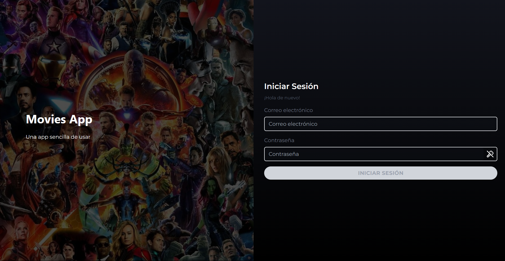
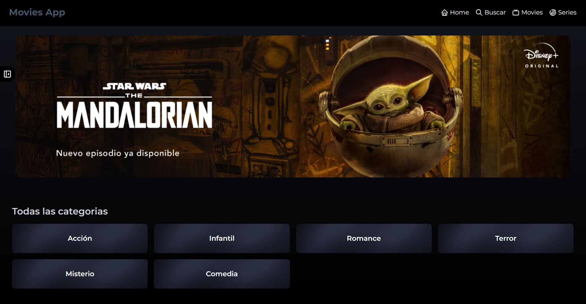

<div align="center">

# Movies App - Una Experiencia Cinematográfica

**Movies App** es una plataforma de streaming inspirada en Disney+, diseñada para ofrecerte una experiencia cinematográfica sin precedentes.

[Ver Demo](https://moviesapp-z3y3gm6dsa-uc.a.run.app/auth/login) · [Reportar Error](https://github.com/VidBarbosa/moviesApp/issues)

[![Contributors][contributors-shield]][contributors-url]
[![Forks][forks-shield]][forks-url]
[![Stargazers][stars-shield]][stars-url]
[![Issues][issues-shield]][issues-url]

</div>

<details>
<summary>Tabla de contenidos</summary>
<ol>
<li><a href="#acerca-del-proyecto">Acerca del Proyecto</a></li>
<li><a href="#tecnologías-utilizadas">Tecnologías Utilizadas</a></li>
<li><a href="#comenzando">Comenzando</a></li>
<li><a href="#contribución">Contribución</a></li>
<li><a href="#contacto">Contacto</a></li>
<li><a href="#agradecimientos">Agradecimientos</a></li>
</ol>
</details>

---

## Acerca del Proyecto




El objetivo de **Movies App** es replicar una experiencia de usuario similar a la de servicios de streaming populares, utilizando tecnologías modernas de desarrollo web. Ofrece características como autenticación de usuarios, contenido dinámico y una gestión de estados eficiente.

### Tecnologías Utilizadas

- [![React][react-badge]][react-url] - Una biblioteca de JavaScript para construir interfaces de usuario.
- [![Typescript][typescript-badge]][typescript-url] - JavaScript con sintaxis para tipos.
- [![Vite][vite-badge]][vite-url] - Una herramienta de construcción que mejora significativamente la experiencia de desarrollo.
- [![Zustand][zustand-badge]][zustand-url] - Una pequeña librería de gestión de estado para React.
- [![Tailwind CSS][tailwind-badge]][tailwind-url] - Un framework de CSS de utilidad para construir rápidamente diseños personalizados.

[react-url]: https://reactjs.org/
[typescript-url]: https://www.typescriptlang.org/
[vite-url]: https://vitejs.dev/
[zustand-url]: https://github.com/pmndrs/zustand
[tailwind-url]: https://tailwindcss.com/
[react-badge]: https://img.shields.io/badge/-React-61DAFB?style=for-the-badge&logo=react&logoColor=white
[typescript-badge]: https://img.shields.io/badge/Typescript-3178C6?style=for-the-badge&logo=typescript&logoColor=white
[vite-badge]: https://img.shields.io/badge/-Vite-646CFF?style=for-the-badge&logo=vite&logoColor=white
[zustand-badge]: https://img.shields.io/badge/-Zustand-FF3E00?style=for-the-badge&logo=reactivex&logoColor=white
[tailwind-badge]: https://img.shields.io/badge/Tailwind_CSS-38B2AC?style=for-the-badge&logo=tailwind-css&logoColor=white

<p align="right">(<a href="#readme-top">volver arriba</a>)</p>

---

## Comenzando

Para explorar **Movies App** localmente, sigue estos pasos sencillos.

### Prerequisitos

- Node.js versión 20.X o superior
- NPM, PNPM o Yarn
- NVM (recomendado para asegurar versión de Node) ver [documentación oficial](https://github.com/nvm-sh/nvm?tab=readme-ov-file#installing-and-updating)

	```sh
	nvm use
	# o
	nvm use <version>
	```

> Si quieres automatizar el proceso, puedes crear un script siguiendo la [documentación oficial](https://github.com/nvm-sh/nvm?tab=readme-ov-file#calling-nvm-use-automatically-in-a-directory-with-a-nvmrc-file)

- PNPM (es nuestra recomendación por su eficiencia y rapidez)

  ```sh
  npm install -g pnpm
  ```

- o NPM

  ```sh
  npm install npm@latest -g
  ```

### Instalación

1. Clona el repositorio

   ```sh
   git clone https://github.com/VidBarbosa/moviesApp.git
   ```

2. Instala los paquetes NPM

   ```sh
   npm install
   ```

3. Ejecuta la aplicación

   ```sh
   npm run dev
   ```

#### Si usas PNPM sigue estos pasos:

1. Instala los paquetes de NPM

   ```sh
   pnpm install
   ```

2. Ejecuta el proyecto

   ```sh
   pnpm run dev
   ```


<p align="right">(<a href="#readme-top">volver arriba</a>)</p>

---

## Contribución

Las contribuciones son lo que hacen a la comunidad de código abierto un lugar increíble para aprender, inspirar y crear. Cualquier contribución que hagas será **muy apreciada**.

1. Haz un Fork del proyecto
2. Crea tu rama de características (`git checkout -b feature/AmazingFeature`)
3. Realiza tus cambios (`git commit -m 'Add some AmazingFeature'`)
4. Sube tus cambios (`git push origin feature/AmazingFeature`)
5. Abre un Pull Request

<p align="right">(<a href="#readme-top">volver arriba</a>)</p>

---

## Agradecimientos

- [Img Shields](https://shields.io)
- [Tabler Icons](https://tabler.io/icons)
- [Platzi Fake API](https://fakeapi.platzi.com/en/about/introduction/)

<p align="right">(<a href="#readme-top">volver arriba</a>)</p>

[contributors-shield]: https://img.shields.io/github/contributors/VidBarbosa/moviesApp.svg?style=for-the-badge
[contributors-url]: https://github.com/VidBarbosa/moviesApp/graphs/contributors
[forks-shield]: https://img.shields.io/github/forks/VidBarbosa/moviesApp.svg?style=for-the-badge
[forks-url]: https://github.com/VidBarbosa/moviesApp/network/members
[stars-shield]: https://img.shields.io/github/stars/VidBarbosa/moviesApp.svg?style=for-the-badge
[stars-url]: https://github.com/VidBarbosa/moviesApp/stargazers
[issues-shield]: https://img.shields.io/github/issues/VidBarbosa/moviesApp.svg?style=for-the-badge
[issues-url]: https://github.com/VidBarbosa/moviesApp/issues

---